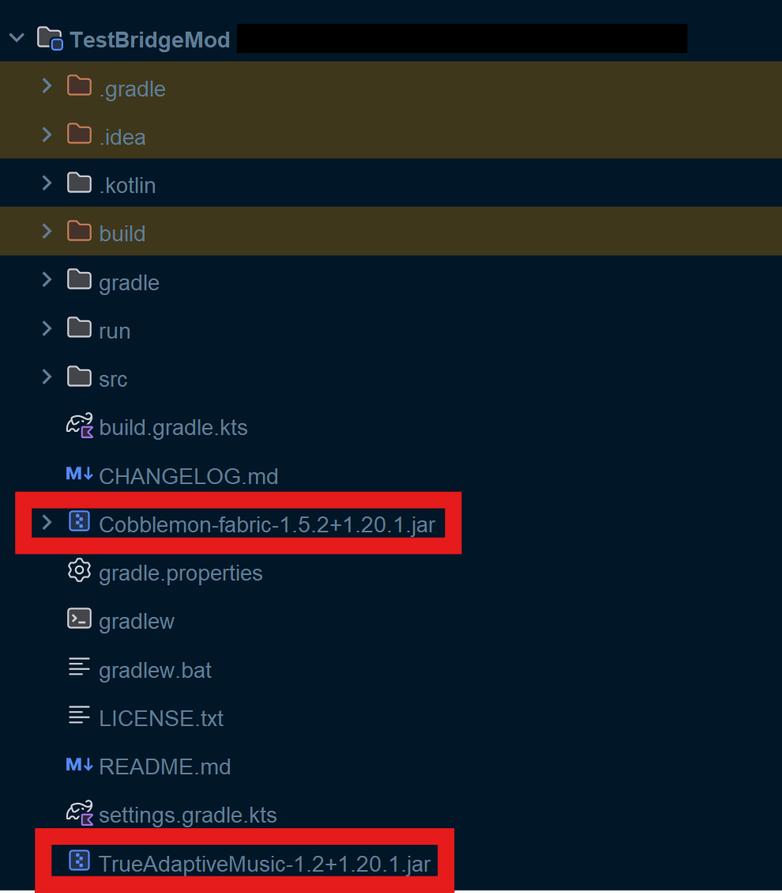
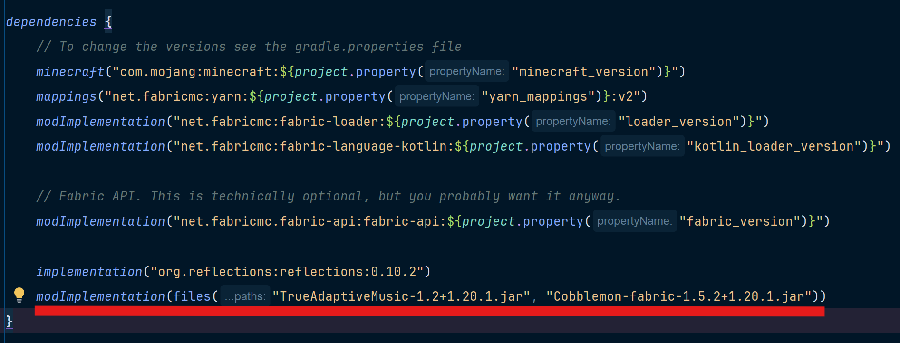
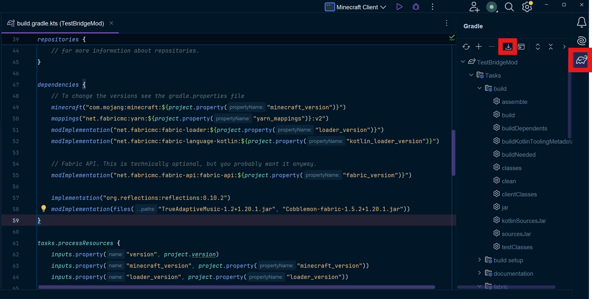

# Modded Predicates and Events

!!! warning

    This is an advanced topic that requires at least some programming experience in Java/Kotlin or other similar high-level languages.
    Modding experience (particularly in Minecraft) is also recommended, but far from required. I assume here that you already know how to create a mod for Minecraft.
    If you are completely new and want to learn how to create a mod, follow the [fabric tutorial here](https://wiki.fabricmc.net/tutorial:start) as well as using [this page](https://docs.fabricmc.net/develop/getting-started/setting-up-a-development-environment) to set up your development environment.

As of version 1.2, TrueAdaptiveMusic now allows the creation of custom predicate and event types! This allows for a whole new level of Music Pack creation as predicates and events can be made that are specific to other mods. One great example is with the Cobblemon mod. This fantastic mod adds the world of Pokémon to Minecraft, and one staple of Pokémon is the battles! There's just one problem, the battles have absolutely no music. What if we could make a new predicate type that specifically is true when the user is in a battle? Then we could specify some battle music to play when it's true! Let's dive in.

## Creating Modded Predicates and Events

First off, if you are someone who likes to learn through seeing a bunch of examples, you can check out the implementations of the vanilla [predicates](https://github.com/LilTOJustice/TrueAdaptiveMusic/tree/master/src/client/kotlin/liltojustice/trueadaptivemusic/client/trigger/predicate/types), [events](https://github.com/LilTOJustice/TrueAdaptiveMusic/tree/master/src/client/kotlin/liltojustice/trueadaptivemusic/client/trigger/event/types), and [mixins for events](https://github.com/LilTOJustice/TrueAdaptiveMusic/tree/master/src/client/java/liltojustice/trueadaptivemusic/client/mixin/event).

Implementing either modded predicates or events (or both) requires creating a "bridge mod". That is, a mod that "bridges" the functionalities of two mods. If you want to create bridge mod for a mod that is using forge/neoforge, this can still work and the setup is mostly the same. If you have any questions about it, I would recommend asking in the discord. If you are the creator of the mod you want to make the bridge for, you could also just follow the steps below as an integration (similar to adding ModMenu support) directly into your mod.

First, make a new mod (or open up your existing mod project if you are the mod owner). I personally recommend using the Minecraft Development plugin with Intellij as it makes the boilerplate steps very easy. However you do it, you'll want to make a mod for the Minecraft version you are using and for fabric.

Once your environment is loaded, you'll want to get the jar files for both your mod (if you are making a bridge mod) and the TrueAdaptiveMusic mod which can be found on curseforge or modrinth. You can also use the cursemaven dependencies if you know how to set those up, which will allow you to skip all the way to [modded predicates](#creating-modded-predicates). Once you have the required jars, throw them into your mod project's base directory.

Once you've done that, your project should look something like this:


Finally, you'll need to add these as dependencies in your gradle build. Open your "build.gradle.kts" file, go to the `dependencies` task and add a `modImplementation` directive for each jar like below:


Finally make sure to download sources for gradle and you're good to go! In IntelliJ this can be done by opening the gradle window and clicking the download icon:


After that task finishes, you're ready to create your custom [predicates](#creating-modded-predicates) or [events](#creating-modded-events)! If you are creating an event, I would still recommend reading the predicate tutorial first, as events are similar but more complicated.

### Creating Modded Predicates
Creating modded predicates is definitely the easier of the two. To start, create a new class under the client section of your mod. For the sake of convention, please name your class with "Predicate" at the end. Here we'll name it PokeBattlePredicate, since we want music to play when we are in a pokemon battle.


#### Implementing the API


After creating the class, have it extend the MusicPredicate abstract class from the TrueAdaptiveMusic API, which you will need to import (your IDE should be able to help you with this). If the class can't be found, try restarting your IDE or downloading sources again as shown above.

```kotlin
class PokeBattlePredicate: MusicPredicate() {
}
```

Now implement the missing virtual function implementation, `test()`

#### Implementing the test Function

This section depends entirely on what your predicate type is actually for. So for this section I'll just show you how the `poke_battle` predicate is implemented, as it is very simple. Luckily, Cobblemon supplies a publicly available singleton object `CobblemonClient` that contains state information for the client. Inside the object is a reference to the battle. This gives us a trivial solution, just check if `battle` is null. If it isn't, return true, otherwise false.

This is the resulting predicate class:
```kotlin
class PokeBattlePredicate: MusicPredicate() {
    override fun test(): Boolean {
        return CobblemonClient.battle != null
    }
}
```

Not all mods will allow such a simple solution though. You may need to use a combination of mixins and accessmodifiers to properly implement. If you run into any issues, feel free to ask for help in the `#modding-help` section of the discord (requires the Modder role). If you want to add parameters to your predicate to allow for further customization of your type, head over [here](#adding-arguments-to-your-predicate-or-event-type).

### Creating Modded Events
Modded event types are more complicated to implement than predicate types, so I would recommend reading [that](#creating-modded-predicates) first. What makes them more complicated is that they will **almost** always require a mixin to implement. I say **almost** because if you are making event types as an integration to a mod you own rather than as a bridge, you can just invoke the event manually from your mod code. If you don't already know how to create mixins, follow [this wiki](https://wiki.fabricmc.net/tutorial:mixin_introduction).

#### Implementing the API

First let's create the event class itself. This is very similar to creating a new predicate type. First create a class implementing the MusicEvent abstract class from the TrueAdaptiveMusic API, following the convention of the class name staring with "On" and ending with "Event". For this example, we'll be creating an event called `OnPokeBattleVictoryEvent` which should trigger when the user wins a pokemon battle:

```kotlin
class OnPokeBattleVictoryEvent: MusicEvent() {
}
```

Unlike predicates, we don't have a `test` function to implement. This is because events aren't evaluated every tick, instead they are manually triggered by a callback invocation. This callback can be accessed via `MusicEvent.invokeMusicEvent` as shown below.

#### Creating the Mixin

Now we'll need to make a mixin to trigger the event. If you are the creator of the mod are making the event for, you can just invoke the callback seen below directly in your mod code.

This particular mixin was a bit painful to work around, but here was the result:
```kotlin
@Mixin(BattleMessagePane::class)
class OnPokeBattleVictoryEventMixin {
    @Inject(
        method = ["addEntry(Lcom/cobblemon/mod/common/client/gui/battle/widgets/BattleMessagePane\$BattleMessageLine;)I"],
        at = [At("HEAD")])
    fun addEntry(entry: BattleMessagePane.BattleMessageLine, ci: CallbackInfoReturnable<Int>) {
        val userWonString =  battleLang("win", MinecraftClient.getInstance().player?.displayName ?: return).string

        if (entry.line.getInternalString() == userWonString) {
            TAMClient.invokeMusicEvent(OnDayStartEvent::class)
        }
    }
}
```

From what I have found, since the mixin target is a Kotlin class, it is best to write the mixin itself in Kotlin as well. This is of course against the standard practice and Java should be used for mixins whenever possible.

As you can see, we are calling `TAMClient.invokeMusicEvent` and passing in the type of our event. This informs the internal music manager to play the event's music. That's really all there is to creating a modded event, but what if you only want the event to play under the conditions based on parameters of an individual event instance? For that you'll first want to [add some parameters to your event type](#adding-arguments-to-your-predicate-or-event-type), and write a `validate` implementation as show below.

#### Implementing the validate Function

If you do add parameters to the event type, you'll want to override the `validate` method. This method is called just before your event is invoked to add a layer of logic to determine whether the event should occur. The parameters that are passed into `validate` are determined at the call site of the event invocation (i.e. in the mixin). For example you might have a setup like this (`stringToTest` is an event argument as described [here](#adding-arguments-to-your-predicate-or-event-type)):
```kotlin title="OnSomethingEvent.kt"
class OnSomethingEvent(private val stringToTest: String): MusicEvent() {
    override fun validate(vararg eventArgs: Any?): Boolean {
        val someCondition = eventArgs[0] as? Boolean ?: return false
        val someString = eventArgs[1] as? String ?: return false
        return someCondition && someString == stringToTest
    }

    ...
}
```
The above code takes in some arguments from the event invoker and interprets them to validate whether the event instance should occur.

Then at the event call site:
```kotlin title="SomeMixin.java"
...
TAMClient.INSTANCE.invokeMusicEvent(OnDayStartEvent.class, someCondition, someString)
...
```
We pass in the type name like usual, but then include the parameters matching the types used in the `validate` definition.

Now the event will only trigger if the validate function says so after the event has been invoked by the mixin.

### Adding Arguments to Your Predicate or Event Type

Just like some vanilla predicates have additional arguments for each instance to specify, modded predicates and events can have the same.

For both events and predicates, you must add your arguments a very specific way. You must either declare your arguments as constructor members (only possible in kotlin) or declare class members with the EXACT matching name of the constructor arguments.

For example, we'll use the `BiomePredicate`:
```kotlin
class BiomePredicate(private val biomes: List<BiomeIdentifier>): MusicPredicate()
```
Here we want any instance of the `BiomePredicate` to store a list of biome identifiers (`biomes`) to match with what the current biome the player is in.

In order for your predicate/event parameters to work, you need to fulfill two conditions for each parameter:

1. They must be declared in the constructor parameter list or be members with exact matching type and name of the constructor parameters.
2. They must be one of the types supported by the UI, otherwise it will be impossible to use the UI to create an instance of the type. For a list of supported types, go [here](Input%20Widgets/Supported%20Input%20Widget%20Types.md). If you want to use a type that isn't supported, you can add support for that type [here](Input%20Widgets/Creating%20an%20Input%20Widget.md).

Serialization will be handled automatically.

Now for predicates, the parameters you created can be used in your `test` function. For events, they can be used in the `validate` function.

### Registering Your Predicate or Event Type
Once your type is ready for use, you need to register it, or it will not be recognized in-game. To do this, you just need to call the TAMClient helper function `registerPredicate` for predicates or `registerEvent` for events. Below is an excerpt from the TrueAdaptiveMusic client initializer for the vanilla types:
```kotlin
...
TAMClient.registerPredicate("boss", BossPredicate::class)
TAMClient.registerPredicate("combat", CombatPredicate::class)
TAMClient.registerPredicate("day", DayTimePredicate::class)
...
TAMClient.registerEvent("on_advancement_get", OnAdvancementGetEvent::class)
TAMClient.registerEvent("on_boss_defeat", OnBossDefeatEvent::class)
TAMClient.registerEvent("on_day_start", OnDayStartEvent::class)
...
```
The first argument will determine the name of your predicate as it is serialized in the music pack rules and should conform to the *snake_case* standard, as well as the *on_* prefix for event types.

The second argument is the runtime object representing the class, which can be retrieved with `::class` in kotlin or `.class` in java.

## Additional Notes

- If a music pack contains trigger types that the client doesn't have the bridge mod for, the pack will still load but those triggers will never occur.
- For some more examples check out the implementations of the vanilla [predicates](https://github.com/LilTOJustice/TrueAdaptiveMusic/tree/master/src/client/kotlin/liltojustice/trueadaptivemusic/client/trigger/predicate/types), [events](https://github.com/LilTOJustice/TrueAdaptiveMusic/tree/master/src/client/kotlin/liltojustice/trueadaptivemusic/client/trigger/event/types), and [mixins for events](https://github.com/LilTOJustice/TrueAdaptiveMusic/tree/master/src/client/java/liltojustice/trueadaptivemusic/client/mixin/event).
