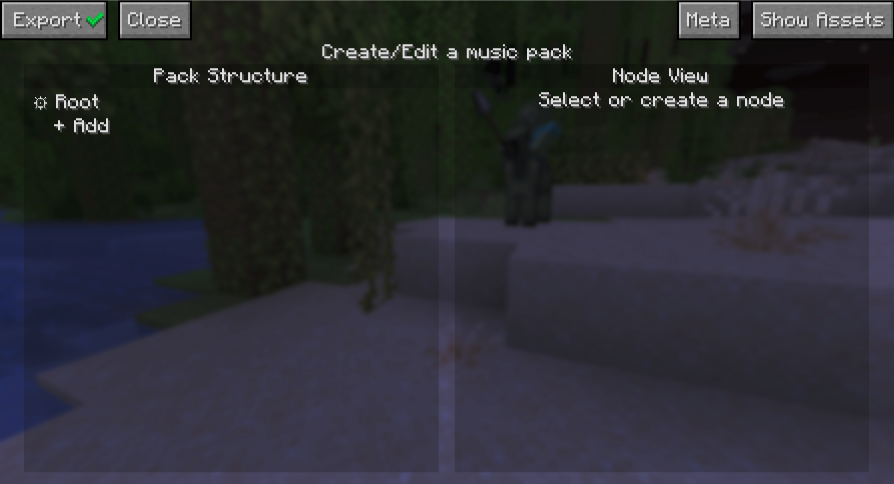
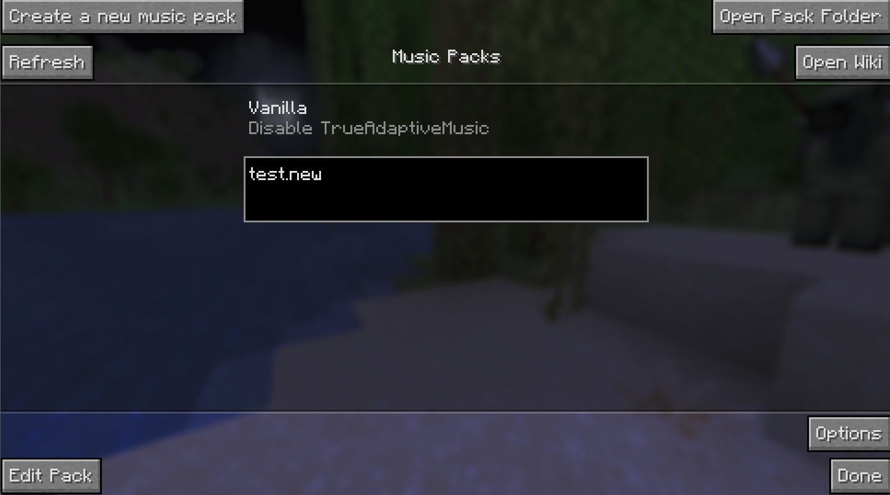
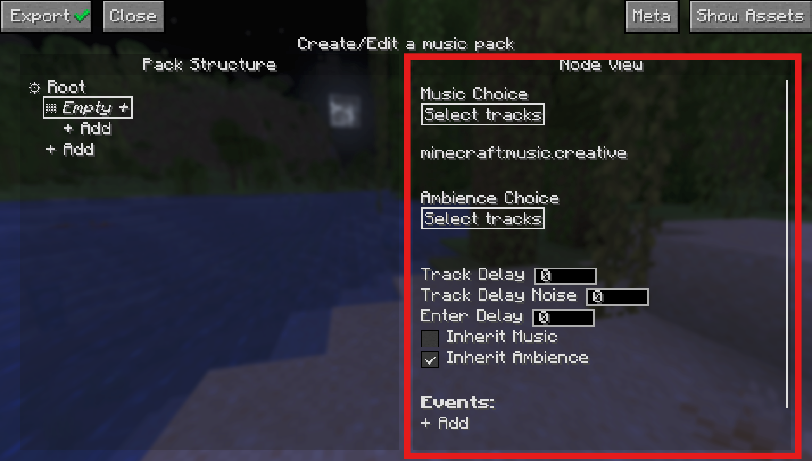
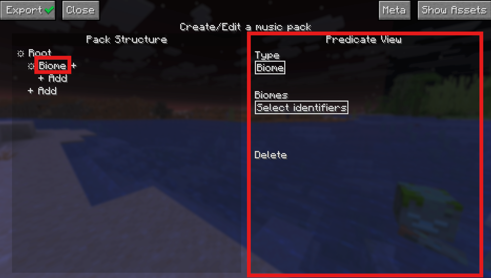
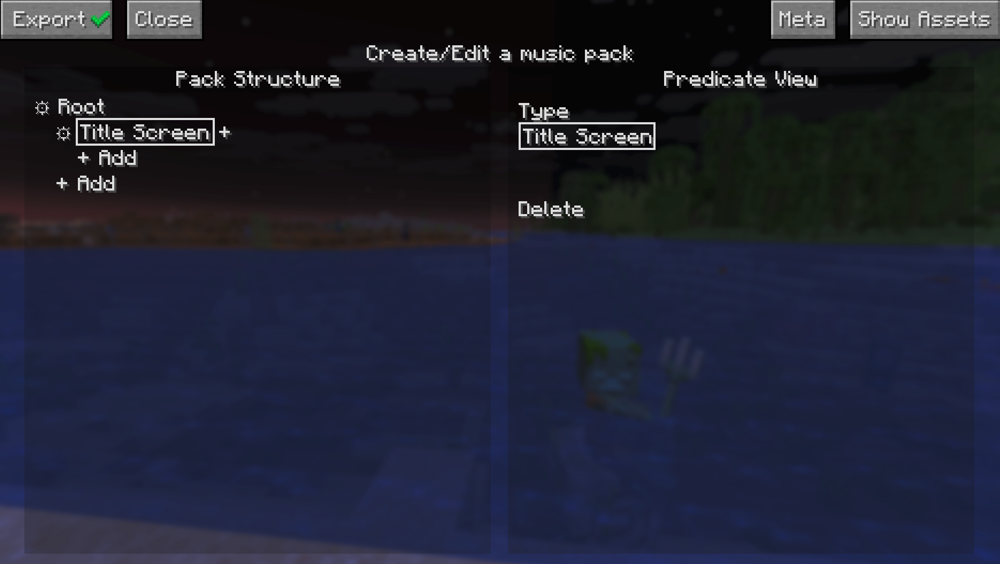
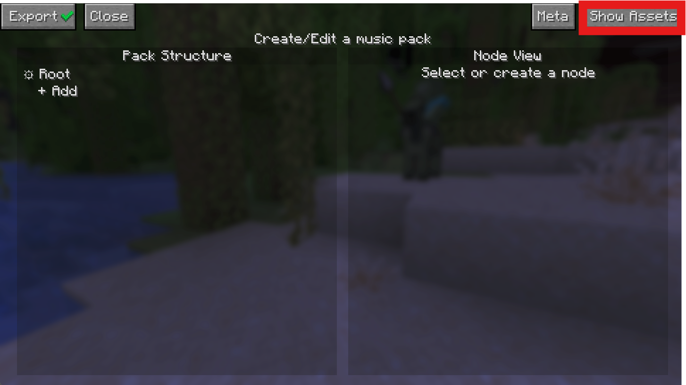
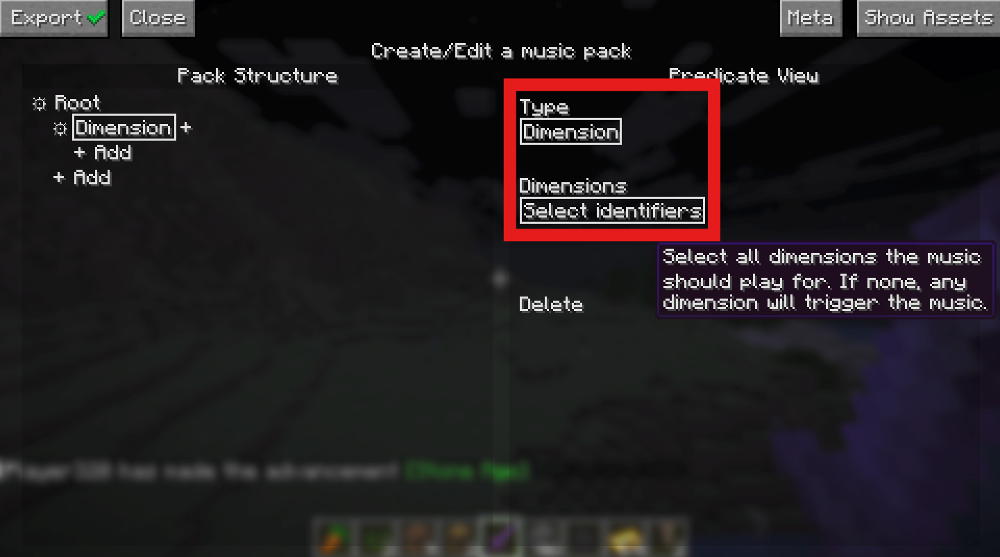
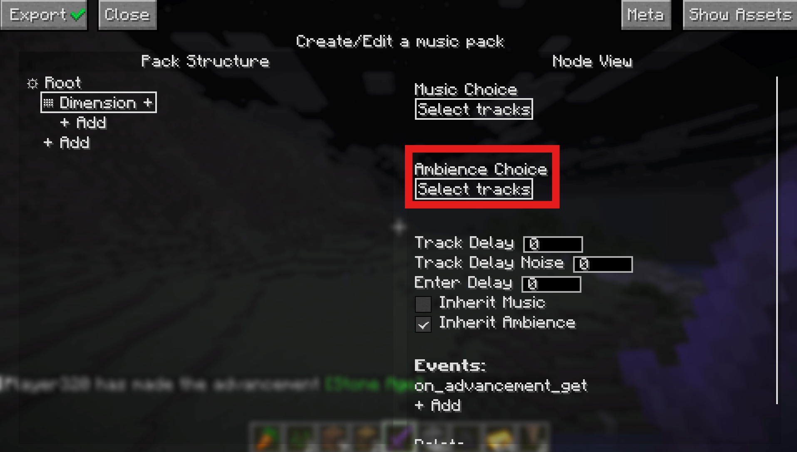
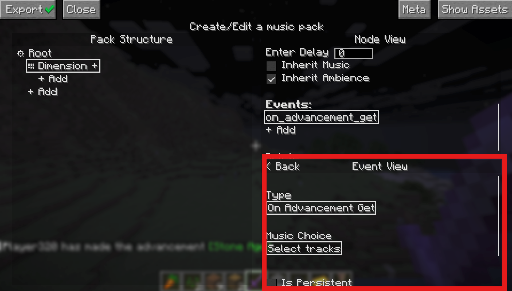
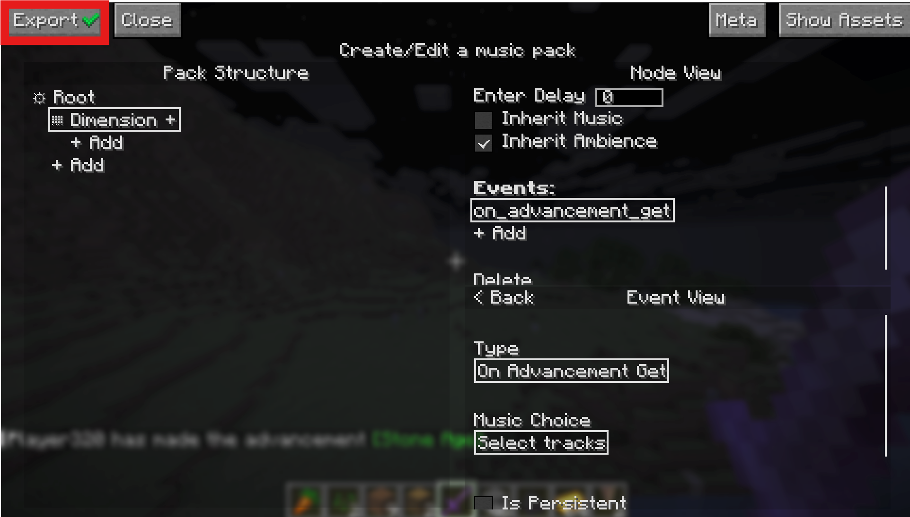

# For Creators

## Quick Start: For Music Pack Creators

### Creating new a Music Pack

So you want to create a Music Pack? First of all, thank you! If you have any creations you are proud of by the end of this I encourage you to share in the [community discord](https://discord.gg/v64K4hNdXu)! Now, let's get started.

Start by clicking the "Create a new music pack" Button at the top left. This will bring up the MusicPack naming screen. Type in a name and hit "Accept" to continue, which will open the pack editing screen:

#### Saving Without Exporting to Zip
Before we do anything, a quick note on saving. When you opened this editing page, a folder was immediately created called {yourpackname}.new in the trueadaptivemusicpacks folder. From now on, every single action you take will be saved in real-time inside this folder. This way you don't need to worry about leaving this menu or game crashes. This also offers a great way to incrementally test your pack since you don't need to export your pack to test it. It will still show up in the main page. Don't believe me? Hit escape to return to the previous page now.

Your new pack should be sitting there all fancy, and it will auto reload as you exit the pack screen for testing. If you are curious what an empty pack looks like, you can hit the "Open Pack Folder" button to take a look. Otherwise, click on your pack if you haven't already, and you will see a "Edit Pack" button show up at the bottom left. Click that to return to the editing screen.

This silence is deafening isn't it, let's go ahead and get some title screen music playing. Click on the add button to create a node. This should open the Node View widget on the right side of your screen.

Then click the "Select tracks" button under "Music Choice" on the right. To open a dropdown of all available music. If you don't have any mods that add music (and you didn't skip ahead and add your own assets), you should just see a list of all the vanilla Minecraft music expressed as Sound Events. Go ahead and pick `minecraft:creative`, we'll be here for a while.

Finally, we need to assign a predicate or the music won't play. Click the + next to the text that says "Empty" to create a predicate.

Now the new node we created has a predicate, which is now selected and the right side now shows the Predicate View widget, which is where you can change any settings for the predicate itself, including what type it is.

Since we want to make title screen music, change the type in the "Type" dropdown to "Title Screen".

Now you should see that the type inside the node has changed to Title Screen. This means that the music that you set in the node will play when we are in the title screen.

For the change to take effect, we need the pack to reload, so go ahead and hit escape, and then hit edit pack again.

Phew! The silence was really getting to me, thanks for that. Now that we have some easy listening, we can talk about the edit screen.

As you can see, the edit screen is separated into two panels, let's talk about the left first, the Pack Structure panel.

### Pack Structure Panel

The pack structure defines the structural logic of your music pack, specifically when certain music should play. Every music pack has a tree-like structure, with the top level only holding the "root" node in that tree. Every node in this tree represents one or more predicates. A predicate is just a condition in which certain music can be played, and can be one of many different types. Every node in the tree has a depth, denoted by how indented the node is on screen, and the "child" node of another node will have 1 more than the depth of its parent. Also within each node is a list of songs/ambience to play when that node is chosen (this is what we chose when setting music on the root node).

### Adding Assets

Now that we know the basics, we can start thinking about how we want to theme the pack. If you are making a pack right now (if you aren't why are you here), you might already have some ideas for how you want to theme your pack. If you do, now would be a good time to gather some assets (external audio files) for your pack. Now I do work for the FBI, CIA, NATO, specifically the Chicago police that patrol O-Block and the Illuminati, so I won't tell you that there are many great ways to get good music from other games to use for your music pack. And I definitely won't tell you that the Internet Archive is a great way to find some. By default Minecraft only supports .ogg files, but lucky you! As of True Adaptive Music 1.2 basically any audio file type is supported, as long as you [setup ffmpeg](../FFmpeg%20Support.md) first. Once you have some files ready, continue on.

#### Where to Place Your Assets

This part is easy as pie, just hit the "Open Assets" folder in the edit screen and drag your files into the folder that opens. If that somehow doesn't work, you can just head to the folder yourself, which is in the same directory as the resourcepacks folder in your Minecraft root installation. Find {your_music_pack_name}.new, open it, and drag your files into the `assets/` folder.

### Other Required Predicate Parameters

With simple predicate types like Title Screen, Day, or Night, the predicate itself is binary (it's either day or it isn't). For other predicate types though, it isn't so simple. Let's examine the dimension predicate for example. First make sure you are loaded into a world, since the dimension registry is only populated when you are.

Once you are loaded in, make your way back to the predicate menu and press the + button on any node (other than root) or create a new node and click the + button to create the new predicate. Set the predicate type in the predicate view to dimension, and you'll see a new "Dimension" parameter.

This is another dropdown that allows you to select an identifier for the dimension you want for the predicate. Here you can select any dimension you want, and then click on the node's gear icon to set music and other settings for the node. As said before, you could create child nodes of this node as well to have specific music for day/night/combat/etc.

### How Nodes are Chosen

At each tick, the True Adaptive Music engine will step through the nodes and explore the first path that it finds that has satisfied predicates. It will then descend the children until it finds the deepest satisfied node. Once that is found, that node will be chosen as the "selected" node for that tick.

This means that the nodes that are defined first at a given depth have "priority" as if they are true, then their siblings will be ignored.

Because of this, it is recommended to place more situational predicates (i.e. combat, boss fights, etc.) at the top since you won't want their music to be interrupted by mundane occurrences.

### Optional Node Parameters

There are some extra parameters tied to each node in the "Node View" panel (when you click the gear icon on a node) below the ambience choice for the node. These are optional and explained by hovering your mouse over them via a tooltip.

### Ambience

Ambience allows you to set any kind of soundscape audio file to play alongside the music of the current node. Ambience has a few behaviors that are different from regular music. Audio that is placed in ambience will automatically fade out as the file ends, leading to more seamless transitions as well as seamless looping if there is only one file provided.

Any stereo ambience audio will also pan between the user's stereo output, preventing the feeling that no matter where you look, sounds are coming from the same place.

### Events

Every node can also have a list of events as well. Consider them like one-shot music triggers rather than a continuous condition in which music plays. To add an event, select any node with the gear icon and click the "+ Add" button add the bottom of the Node View widget on the right.

Now the Node View panel splits in half and the new Event View Panel appears below it. Here you can customize the event the same way you do with predicates. The music you pick here will be played specifically when the event occurs, assuming any of the node's predicates or it's children are satisfied.

Once you are done creating/editing the event, you can either hit the "Back" at the top of the panel to close the event view panel.

### Exporting the Pack

That's really all there is to it. You can head to [Other Functionalities](#other-functionalities) for any other features in the editor, but you now know everything you need to make a Music Pack... except... well exporting. Luckily this is super simple, just hit the "Export" button at the top left:

This will delete your ".new" directory and replace it with a zipped up version in the same pack directory so you can send it around easily. Zip files can also be loaded the same way as directories, so you don't need to unzip it to use it. If you decide you want to edit your pack again, just select your ".zip" pack in the pack selection screen and select "Edit Pack" again. This will create another ".new" directory pack and keep your ".zip" as a backup. Selecting "Export" on the ".new" pack will overwrite your existing ".zip" pack.

**Note: If you have a pack with a large amount of assets, exporting may take a while and it will look like the game is frozen. Please be patient as it may take a while to zip a large amount of data depending on your hardware.**

### Outro

Congrats on making it through this "quick" start. Once again, please let us know if there is anything you want to see improved with this wiki! You can now head to the MusicPacks section at the top left of this wiki for more info on the inner workings of MusicPacks! If you want to take a look at some more advanced capabilities for Music Pack creation such as adding custom predicate and event types, also take a look at the **Advanced Topics** section.

### Other Functionalities

#### Moving/Copying Nodes

You can move nodes by simply clicking and dragging the grabber icon attached the selected node after clicking the gear icon. An arrow will show exactly where your node will go when you release the button. You can't move any nodes above root, and you also can't move a node to be a child of itself.

If you hold `shift`, you can copy the node (which allows bypassing some of the aforementioned restrictions), and you can hold `ctrl` as well to copy all of a node's children along with the node.

#### Hybrid predicate nodes

Nodes can have more than one predicate, which can be achieved by hitting the + sign next to the node multiple times.

When a node has multiple predicates, it will be satisfied as long as at least one of the predicates within it is satisfied, equivalent to a logical "OR".