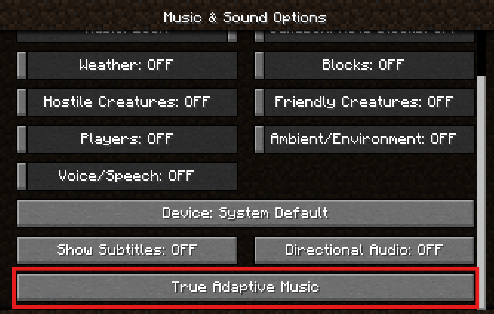
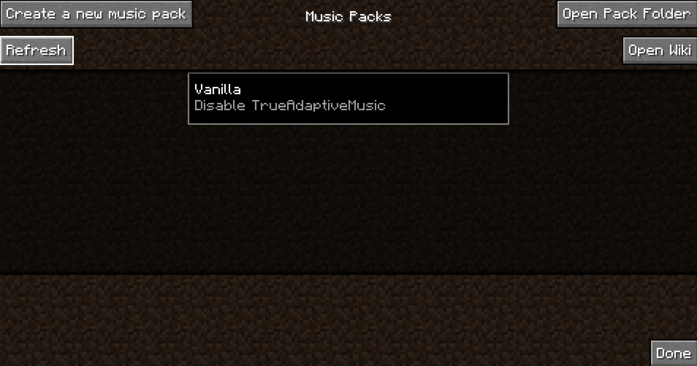

# For Everyone (Start Here)

## Quick Start: For Everyone

First start up Minecraft with the mod loaded and you will now notice a new button at the bottom of the Music & Sound Options menu:

Clicking this will take you to the main menu for True Adaptive Music:

Next stop, [Quick Start: For Users](For%20Users.md). If you are a creator and already have used the mod before, you can skip over to [Quick Start: For Creators](For%20Creators.md)
