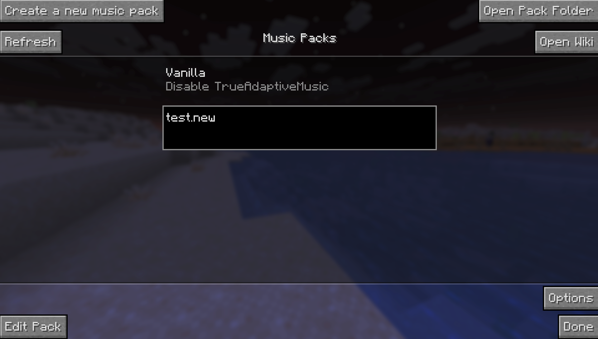
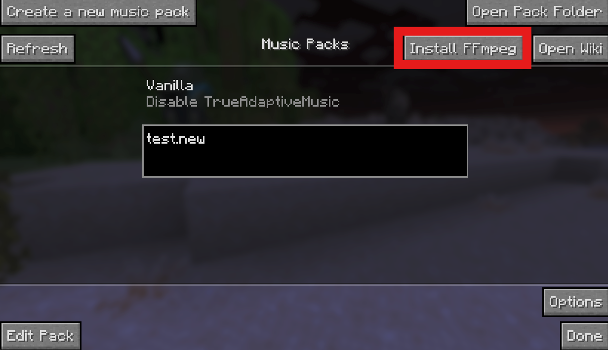

# For Users

## Quick Start: For MusicPack Users

Hit "Open Pack Folder" to reveal the folder where Music Packs are stored. This will be the **trueadaptivemusicpacks/** folder, which is generated inside of your Minecraft's installation root (the same folder where you see resourcepacks) the first time you start up Minecraft with the mod.

Throw your .zip or directory file into this folder, then hit "Refresh", and voila! You'll see it show up on this page.

Now just click on your newly loaded pack and (assuming there is custom title screen or root music), you should immediately notice the difference! Have Fun :wink:

It is also recommended to install ffmpeg if you haven't already. This will allow you to hear music from packs that don't just use .ogg files.

You can install it by clicking the "Install FFmpeg" button at the top-right of the pack selection screen:

If there are any issues with loading the pack such as missing dependencies, you will see an "Issues Found" message on the pack.

And that's it!

If you'd like to create a Music Pack, head on over to [Quick Start: For Creators](For%20Creators.md)!
